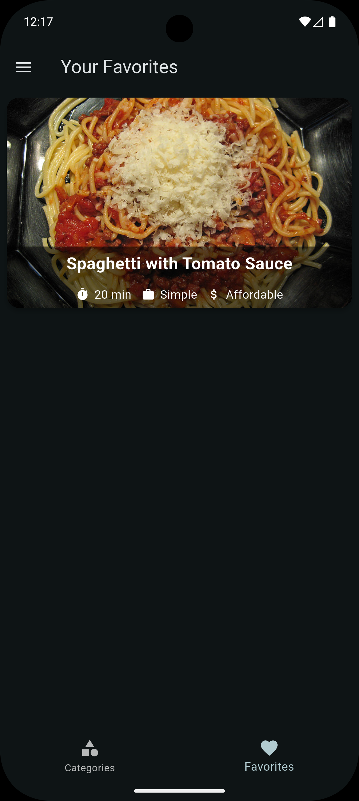

# Meals App

Meals is a beautifully designed Flutter application that allows users to browse, filter, and favorite a variety of meals. The app demonstrates advanced state management using Riverpod, custom animations, and a modern UI with Google Fonts.

## Features

- Browse meals by categories
- View detailed meal information (ingredients, steps, image)
- Mark/unmark meals as favorites
- Filter meals by dietary preferences (gluten-free, lactose-free, vegetarian, vegan)
- Responsive and animated UI
- State management with Riverpod

## Screenshots

| Home (Categories) | Meals List | Meal Details | Favorites | Filters |
|:----------------:|:----------:|:------------:|:---------:|:-------:|
|  |  |  |  |  |


## Demo Video

Watch the app in action on Appetize:

[![Demo Video]](https://appetize.io/app/b_55hm37sriomex6kbvsfxmfjara)


## Getting Started

1. **Clone the repository:**
   ```sh
   git clone https://github.com/SolomonB127/Meals.git
   cd meals
   ```
2. **Install dependencies:**
   ```sh
   flutter pub get
   ```
3. **Run the app:**
   ```sh
   flutter run
   ```

## Technologies Used

- [Flutter](https://flutter.dev/)
- [Riverpod](https://riverpod.dev/)
- [Google Fonts](https://pub.dev/packages/google_fonts)

## Folder Structure

```
lib/
  data/         # Dummy data and meal models
  model/        # Category model
  providers/    # Riverpod providers for filters, favorites, meals
  screens/      # App screens (categories, meals, details, filters, tabs)
  widgets/      # Reusable widgets (meal item, category grid, etc.)
```

## License

This project is licensed under the MIT License.
